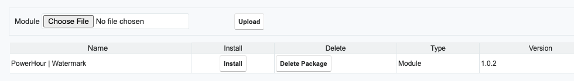

# Sugar Developer Watermark

A module loadable package which provides a developer with the ability to add a watermark to the Sugar

## Installation
* Log in to Sugar as an Administrator
* Select the Admin option from the Profile Menu
* Select Module Loader from the Developer Tools 
* Upload the file builds/powerhour_sugar_watermark_1.0.x.zip
* Press the Install button 
